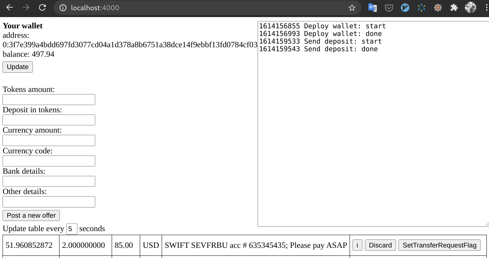
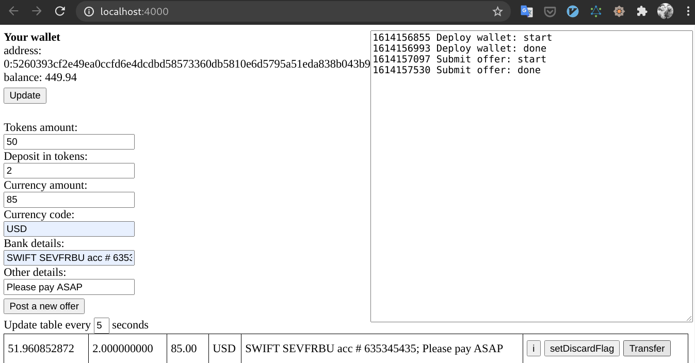
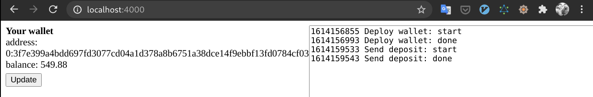
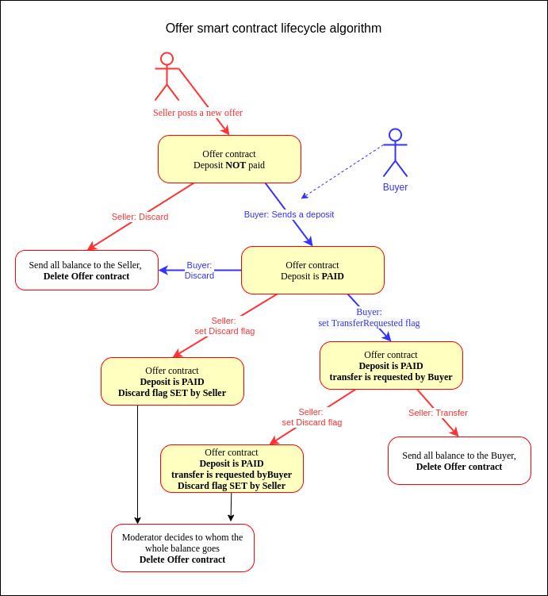

# Simple TON application

## Audience

Novice blockchain developers, who prefer to learn by doing.

## Content Table

-   [Simple TON application](#simple-ton-application)
    -   [Audience](#audience)
    -   [Content Table](#content-table)
    -   [What are we building?](#what-are-we-building)
    -   [Setup](#setup)
    -   [Run tests to check integrity](#run-tests-to-check-integrity)
    -   [Blockchain net.ton.dev and TON OS SE](#blockchain-nettondev-and-TON-OS-SE)
    -   [Tokens](#tokens)
    -   [Run the App](#run-the-app)
        -   [Rules](#rules)
        -   [Sample deal](#sample-deal)
    -   [Algorithm](#algorithm)
    -   [Conslusion](#conslusion)
    -   [Troubleshooting](#troubleshooting)
    -   [Appendix A](#appendix-a)
        -   [How to get a wallet with crystals](#how-to-get-a-wallet-with-crystals)

## What are we building?

We will build an application in which one person can sell crystals to another. Fiat funds are transferred outside the blockchain and all disputed cases are resolved by a moderator.

## Setup

```
$ git clone git@github.com:tonlabs/sdk-samples.git
$ cd sdk-samples/demo/web_p2p_exchange
$ npm i
```

## Run tests to check integrity

Prerequisites:

TON OS SE installed and listening on 127.0.0.1:80

> If you are running TON OS SE on a custom IP or port, please change the TON_SERVER_ADDRESS variable in **`/src/config.js`** accordingly.

```
npm test
```

If test passes you can go directly to the **[Run the App](#run-the-app) section**, else check [Troubleshooting](#troubleshooting) section.

## Blockchain net.ton.dev and TON OS SE

By default this application is configured to use a standalone blockchain **TON OS SE**, which helps you quickly debug and test your application.

TON OS SE is twenty times faster than a **net.ton.dev** blockchain, so it's a real time saver.
It's very easy to [install TON OS SE](https://docs.ton.dev/86757ecb2/p/324b55-installation) if you already have Docker installed

If your choice is TON OS SE, you are ready to [run the application](#run-the-app)

You can run this application on **net.ton.dev** blockchain, but you must have your own "Giver" smart contract. See next section

## Tokens

Each participant of our application must have their own wallet with crystals.

In real life, your wallet is only yours, but in our example, the wallets of all participants are initially filled from another smart contract, called a **Giver**

How many tokens does this Giver have? It depends if you are using TON OS SE or net.ton.dev

-   TON OS SE.

    There are 1.5 billion test tokens in your Giver contract and everything is ready to run the app

-   net.ton.dev.

    You should have your own 'Giver' smart contract (see `src/ton-contracts/giver.package.js`) with some crystals on its balance. If so, just fill in the following variables in `src/config.js`:

    ```
     GIVER_ADDRESS = <your_wallet_contract_addres>
     GIVER_PUBLIC_KEY = <your_wallet_contract_public_key>
     GIVER_SECRET_KEY = <your_wallet_contract_secret_key>
    ```

    Of course you should never do this in a real application. Exposing your keys to the frontend is crazy!

    If you don't have a wallet yet - see [Appendix A](#appendix-a)

## Run the App

Our App doesn't need a backend, but needs to serve `.html` and `.js` files, so let's start a http server provided by webpack:

```
$ npm run start
```

To be both seller and buyer, you need to open `http://localhost:4000/` in separate tabs.

Wait for your wallet to be deployed. Now you can place your first offer (of course no more than the balance of your wallet)

### Rules

-   To sell crystals, Seller deploys a special "Offer" smart-contract, see `src/ton-contracts/Offer.sol`
-   The deal is made for the entire offered volume of crystals. There is no partial sale / purchase.
-   Buyers find offers by querying GraphQL by Offer contract hash code.
-   To start a deal, the Buyer must transfer the specified number of crystals to the Offer contract as a security deposit.
-   After transferring the deposit, the buyer must transfer the fiat money off-chain.
-   From the moment of receiving the insurance deposit, it's impossible for the Seller to withdraw crystals. Before this moment, it's possible at any time
-   The Seller, after receiving the off-chain payment, sends a confirmation to the Offer contract, after which the crystals and the security deposit are transferred to the Buyer's account and the contract is deleted

Moderator's key pair was generated in advance, and:

-   The secret key is kept by a person who becomes the moderator
-   The public key has been hardcoded into the Offer contract.
-   The code_hash of the compiled offer contract has been hardcoded into the application code.

Thus anyone can deploy such contract but no one can change it without changing contract code hash.

### Sample deal

**Step 1. The seller has just placed an offer to sell 50 crystals for \$ 85**

At this moment the seller can discard this offer at his will.

> Unfortunately, **there is no way to deploy a contract with an exact amount**, and as we can see, the exact amount is slightly less than 50 Crystals.


---

**Step 2. Buyer sees offers**


---

**Step 3. Buyer has pressed "Send deposit" button**

You can see now the balance of his wallet is decreased to (500 - 2) crystals.
Now the buyer has two options:

-   click `Discard` - to cancel the deal and lose his deposit
-   OR make a \$85 transfer out of chain and click `SetTransferRequestFlag`to emphasize that fact



---

**Step 4. Seller sees that deposit has been paid**

Now Seller has two options:

-   If he has not received fiat money within a reasonable period of time, he can click `setDiscardFlag`.
    This is a signal to the moderator that the Seller claims to cancel deal.
-   Click `Transfer`. In this case, the entire balance of the contract (51.96) will be transferred to the Buyer's wallet.



---

**Step 5. Seller has clicked `Transfer` to send cristals to the Buyer**

Buyer's wallet balance has increased to 500 + 50 crystals



---

To fully understand the workflow and how a moderator can resolve disputes, see the algorithm below.

## Algorithm



## Conslusion

In the next part we will add a DeBot to make our application immediately available to all Surf users.

## Troubleshooting

If you choose to use TON OS SE, then this application requires TON OS SE ver >= 0.25. Run `tondev se info` to see current version

## Appendix A

### How to get a wallet with crystals

The easiest way to get Crystals is to install the Surf Mobile App and [get 100 tokens to your Surf wallet](https://help.ton.surf/en/support/solutions/articles/77000397851-how-to-get-coins-in-developer-mode-).

When you have got crystals you need:

1. To deploy a 'Giver' smart contract (see `src/ton-contracts/giver.package.js`) with some Crystals on its balance
2. To fill next variables in `src/config.js`:

```
 GIVER_ADDRESS = <your_wallet_contract_addres>
 GIVER_PUBLIC_KEY = <your_wallet_contract_public_key>
 GIVER_SECRET_KEY = <your_wallet_contract_secret_key>
```

**Of course you should never expose your keys in a real application!**
