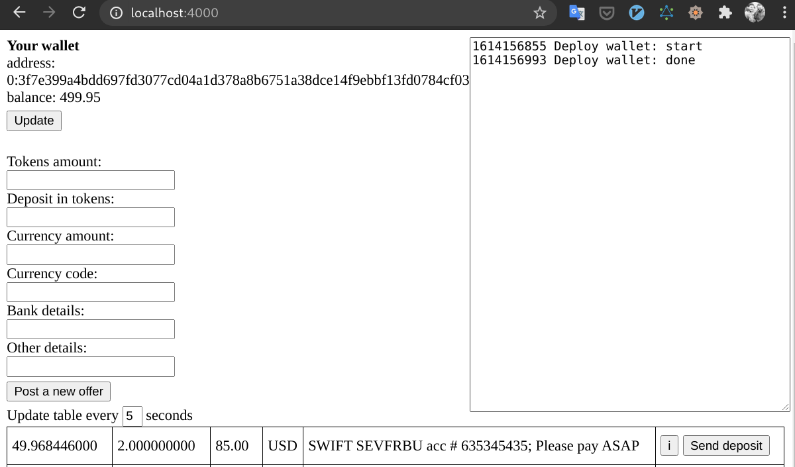
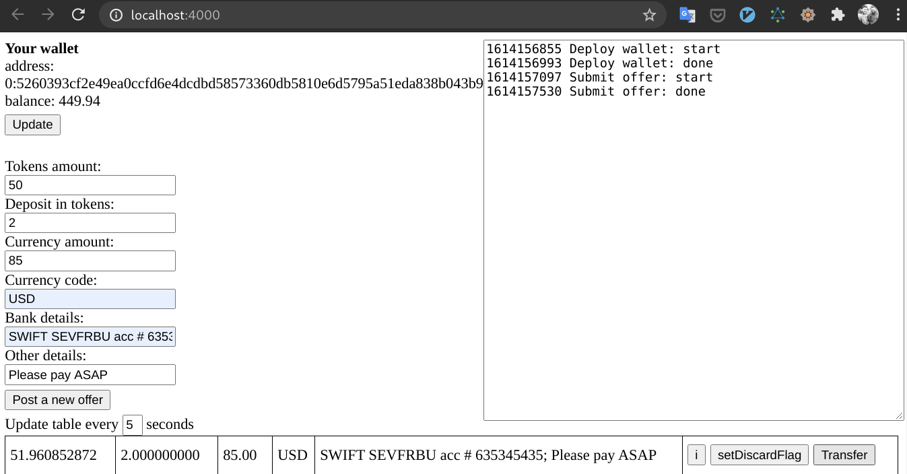
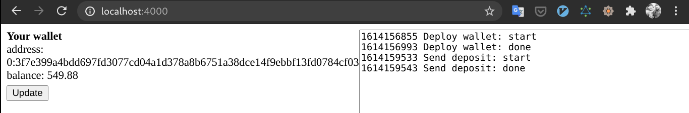
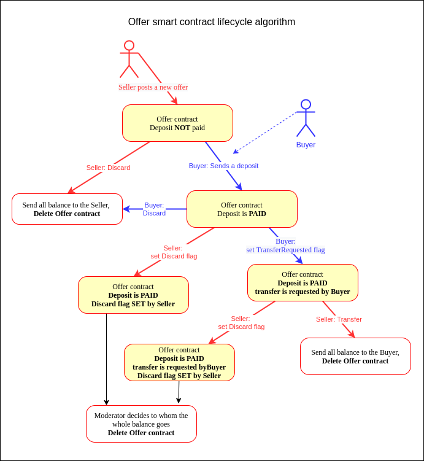

# Simple TON application

## Audience

Novice blockchain developers, who prefer to learn by doing.

## Content Table

-   [What are we building?](#what-are-we-building)
-   [Setup](#Setup)
-   [Run tests to check integrity](#run-tests-to-check-integrity)
-   [Blockchain net.ton.dev and NodeSe](#blockchain-nettondev-and-nodese)
-   [Tokens](#tokens)
-   [Run the App](#run-the-app)
    -   [Rules](#rules)
    -   [Sample deal](#sample-deal)
-   [Algorithm](#algorithm)
-   [Conslusion](#conslusion)
-   [Appendix A](#appendix-a)

## What are we building?

We will build an application in which one person can sell crystals to another. Fiat funds are transferred outside the blockchain and all disputed cases are resolved by a moderator.

## Setup

```
$ git clone git@github.com:tonlabs/simple-ton-app.git
$ cd simple-ton-app
$ npm i
```

## Run tests to check integrity

```
npm run test
```

The test takes up to 10 minutes (see jest.config `testTimeout`), and **if passes you can go directly to the [Run the App](#run-the-app) section**

Why the time is not determined?
To simplify greatly, we can say the following:
the process of sending messages to blockchain **does not guarantee their processing at a strictly defined time.**

As a result, some questions arise: How long to wait for processing? Something went wrong and we need to re-send the message or just wait?

It's rather difficult to create a robust system in such conditions, and this is where **TON SDK comes to the rescue**.
It ensures that if a message hasn't been processed at a predetermined time, it will never get processed.

<!---
      (i) To fulfill such guarantees:
      -  the line `pragma AbiHeader expire;` must be included in a contract.
      - `tonClient.abi.message_processing_timeout` is specified.
-->

## Blockchain net.ton.dev and NodeSE

Smart contracts need a blockchain. By default this application uses a standalone blockchain **NodeSE**, which helps you quickly debug and test your application.

NodeSE is twenty times faster than the real blockchain, so it's a real time saver.
It's very easy to [install NodeSE](https://docs.ton.dev/86757ecb2/p/324b55-installation), if you already have Docker installed

> If you are running your NodeSE on a custom IP or port, please change the NODE_SE_TON_SERVER_ADDRESS variable in **`/src/config.js`** accordingly.

<!---
Tip. I prefer not to have Docker on my netbook and use a $5/month VDS with Docker pre-installed.
Since this is for testing purposes only, I save time not to configure the user and run the following command as root:

root@vm# docker run -d --name local-node -e USER_AGREEMENT=yes -p80:80 tonlabs/local-node
-->

If your choice is NodeSE,you are ready to [run the application](#run-the-app)

You can of course run this application at **net.ton.dev**. This is a real blockchain consisting of several nodes, but you must have test tokens - Crystals. See next section

## Tokens

Each participant of our application must have their own wallet with crystals.
In real life, your wallet is only yours, but in our example, the wallets of all participants are initially filled from another smart contract. Let's call it a **Giver**

How many tokens does this Giver have? It depends if you are using NodeSE or net.ton.dev

-   NodeSE.

    There are 1.5 billion test tokens in your Giver contract and everything is ready to run the app, just check the variable **`NODE_SE=true`** in `/src/config.js`

-   net.ton.dev.

    If you already have a wallet contract with some crystals, just fill in the following variables in `src/config.js`:

    ```
     NODE_SE = false
     GIVER_ADDRESS = <your_wallet_contract_addres>
     GIVER_PUBLIC_KEY = <your_wallet_contract_public_key>
     GIVER_SECRET_KEY = <your_wallet_contract_secret_key>
    ```

    Of course you should never do this in a real application. Exposing your keys to the frontend is crazy!

    If you don't have a wallet yet - see [Appendix A](#appendix-a)

## Run the App

Our App doesn't need a backend, but needs to serve `.html` and `.js` files, so let's start a http server provided by webpack:

```
$ npm run start
```

To be both seller and buyer, you need to open `http://localhost:4000/` in separate tabs.

Wait for your wallet to be deployed. Now you can place your first offer (of course no more than the balance of your wallet)

All logging is done in the panel on the right. **The app is set to do retries forever and always succeeds, just be patient**

### Rules

-   To sell crystals, Seller deploys a special [Offer smart-contract](https://github.com/tonlabs/simple-ton-app/blob/master/src/ton-contracts/Offer.sol)
-   The deal is made for the entire offered volume of crystals. There is no partial sale / purchase.
-   Buyers find offers by querying GraphQL by Offer contract hash code.
-   To start a deal, the Buyer must transfer the specified number of crystals to the Offer contract as a security deposit.
-   After transferring the deposit, the buyer must transfer the fiat money off-chain.
-   From the moment of receiving the insurance deposit, it's impossible for the Seller to withdraw crystals. Before this moment, it's possible at any time
-   The Seller, after receiving the off-chain payment, sends a confirmation to the Offer contract, after which the crystals and the security deposit are transferred to the Buyer's account and the contract is deleted

Moderator's key pair was generated in advance, and:

-   The secret key is kept by a person who becomes the moderator
-   The public key has been hardcoded into the Offer contract.
-   The code_hash of the compiled offer contract has been hardcoded into the application code.

Thus anyone can deploy such contract but no one can change it without changing contract code hash.

### Sample deal

**Step 1. The seller has just placed an offer to sell 50 crystals for \$ 85**

At this moment the seller can discard this offer at his will.

> Unfortunately, **there is no way to deploy a contract with an exact amount**, and as we can see, the exact amount is slightly less than 50 Crystals.


---

**Step 2. Buyer sees offers**



---

**Step 3. Buyer has pressed "Send deposit" button**

You can see now the balance of his wallet is decreased to (500 - 2) crystals.
Now the buyer has two options:

-   click `Discard` - to cancel the deal and lose his deposit
-   OR make a \$85 transfer out of chain and click `SetTransferRequestFlag`to emphasize that fact


---

**Step 4. Seller sees that deposit has been paid**

Now Seller has two options:

-   If he has not received fiat money within a reasonable period of time, he can click `setDiscardFlag`.
    This is a signal to the moderator that the Seller claims to cancel deal.
-   Click `Transfer`. In this case, the entire balance of the contract (51.96) will be transferred to the Buyer's wallet.



---

**Step 5. Seller has clicked `Transfer` to send cristals to the Buyer**

Buyer's wallet balance has increased to 500 + 50 crystals



---

To fully understand the workflow and how a moderator can resolve disputes, see the algorithm below.

## Algorithm



## Conslusion

In the next part we will add a DeBot to make our application immediately available to all Serf users.

## Appendix A

### How to get a wallet with crystals

The easiest way to get Crystals is to install the Surf Mobile App and [get 100 tokens to your Surf wallet](https://help.ton.surf/en/support/solutions/articles/77000397851-how-to-get-coins-in-developer-mode-).

When you have got crystals::

1. run the script

    ```
    $ node src/deployGiver.js
    Giver contract address is: 0:4de5d782ae4eb3ee962ae9fa22ae800f673af0dc1c7f5b1ca177a7cf105132fc
    Do not interrupt this script!
    It's waiting for the balance of this account to become positive to continue execution
    ```

2. Go to the Surf and transfer tokens to the specified address.
3. Once the transaction is complete, the script will deploy the Giver contract, just wait.
4. Fill next variables in `src/config.js`:

```
 NODE_SE = false
 GIVER_ADDRESS = <your_wallet_contract_addres>
 GIVER_PUBLIC_KEY = <your_wallet_contract_public_key>
 GIVER_SECRET_KEY = <your_wallet_contract_secret_key>
```

**Of course you should never expose your keys in a real application!**
